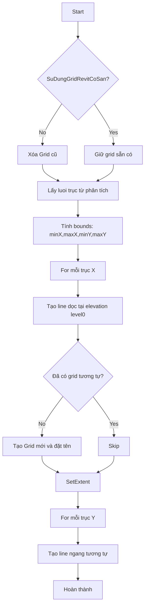
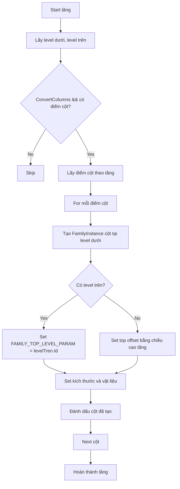
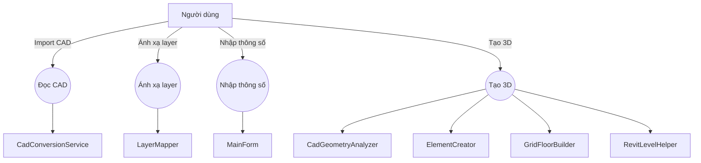

# CHƯƠNG II: KIẾN TRÚC VÀ THIẾT KẾ GIAO DIỆN PHẦN MỀM

## 2.1 Kiến trúc tổng thể phần mềm

Phần mềm CAD2Revit được tổ chức theo các thành phần chính sau:

- `Views/MainForm.cs`: giao diện WinForms, thu thập thông số người dùng và khởi động quá trình chuyển đổi.
- `Services/CadConversionService.cs`: dịch vụ trung gian, điều phối đọc CAD và chuyển đổi sang Revit.
- `Converter/CadReader.cs`: đọc dữ liệu CAD từ `ImportInstance` trong Revit.
- `Converter/CadGeometryAnalyzer.cs`: phân tích dữ liệu CAD để xác định trục, cột, dầm, sàn, vùng và lỗ thủng.
- `Converter/ElementCreator.cs`: tạo các đối tượng Revit (level, grid, floor, column, beam, wall, roof).
- `Converter/GridFloorBuilder.cs`: tạo lưới trục và các tấm sàn dựa trên kết quả phân tích.
- `Helpers/RevitLevelHelper.cs`: quản lý level, đổi tên level sẵn có, tính cao độ theo thông số nhập.
- `Helpers/StructuralGridSystem.cs`: sinh lưới trục và đường biên sàn theo logic trục.
- `Helpers/RevitTcvnHelper.cs`: chọn family, kích thước và kết nối vật liệu theo chuẩn TCVN.

### Nội dung chính

- Người dùng nhập thông số tầng, số tầng, kích thước dầm, độ dày sàn.
- Phần mềm đọc CAD và gán từng layer CAD vào loại cấu kiện (cột, dầm, sàn, tường, bỏ qua).
- Phần mềm phân tích CAD để sinh trục, vùng sàn, điểm cột, đường dầm.
- Phần mềm tạo level, grid, floor, column, beam, wall trong Revit.

## 2.1.1 Lưu đồ thuật toán tạo lưới trục



## 2.1.2 Lưu đồ thuật toán tạo cột



## 2.1.3 Lưu đồ thuật toán tạo dầm

```mermaid
flowchart TD
  A[Start tầng] --> B[Lấy cao trình dầm]
  B --> C[For mỗi đường dầm phân tích]
  C --> D{Dầm thuộc phạm vi tầng?}
  D -- No --> E[Skip]
  D -- Yes --> F{Đã tạo dầm này chưa?}
  F -- Yes --> E
  F -- No --> G[Chọn family dầm theo kích thước]
  G --> H[Lấy level dầm = _cacLevel[tang+1] hoặc current level]
  H --> I[Tạo line beam ở z = levelDam.Elevation]
  I --> J[Tạo beam FamilyInstance trên levelDam]
  J --> K[Tính offset lên cao trình dầm và áp dụng]
  K --> L[Set kích thước, vật liệu]
  L --> M[Đánh dấu dầm đã tạo]
  M --> N[Next dầm]
```

## 2.1.4 Lưu đồ thuật toán tạo sàn

```mermaid
flowchart TD
  A[Start tạo sàn] --> B{ConvertFloors?}
  B -- No --> Z[End]
  B -- Yes --> C[For mỗi tầng]
  C --> D{ShouldCreateFloor(tang)?}
  D -- No --> C
  D -- Yes --> E[Lấy boundary cho tầng]
  E --> F{Có boundary?}
  F -- No --> C
  F -- Yes --> G[Tạo CurveLoop từ boundary]
  G --> H[Floor.Create(doc, loops, floorType.Id, level.Id)]
  H --> I[Đánh dấu đã tạo]
  I --> C
  C --> J{Tạo sàn mái?}
  J -- Yes --> K[CreateRoofFloor()]
  K --> L[End]
  J -- No --> L[End]
```

## 2.2 Sơ đồ Use-case



## Ghi chú triển khai

- `MainForm` chịu trách nhiệm giao diện và cấu hình.
- `CadConversionService` là đầu mối, gọi `ReadCad`, `ApplyLayerMappings`, `ConvertModel`.
- `CadGeometryAnalyzer` tạo ra dữ liệu nền cho việc sinh grid, cột, dầm, sàn.
- `ElementCreator` là nơi thực sự sinh ra đối tượng Revit.
- `GridFloorBuilder` tách riêng phần tạo grid và sàn để module hóa.
- `RevitLevelHelper` quản lý level, đổi tên và tính cao độ theo thông số input.

