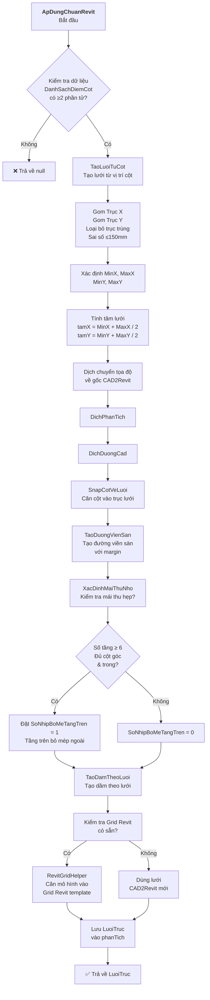
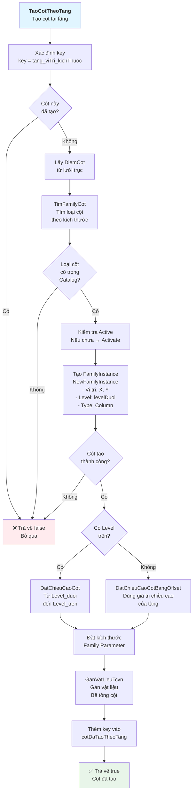
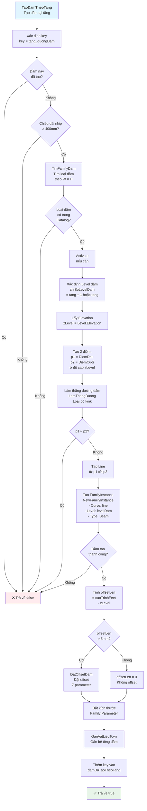
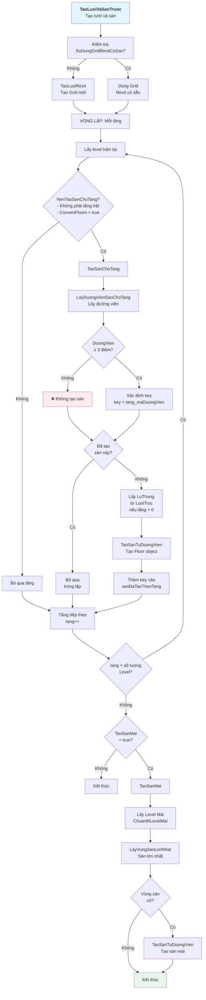
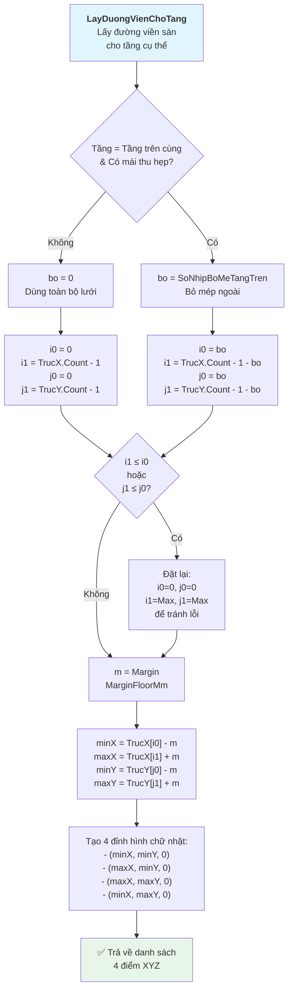
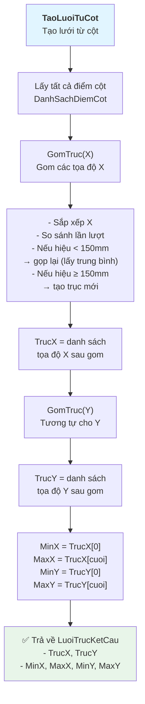
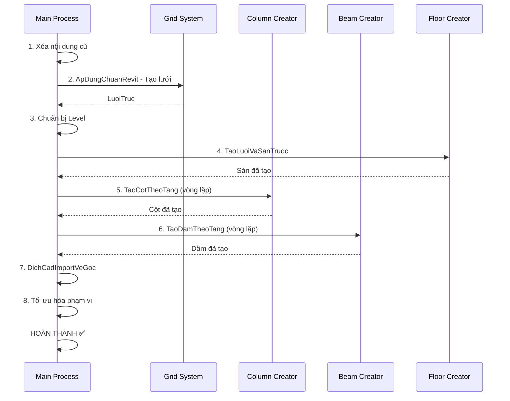

# Lưu Đồ Thuật Toán CAD2Revit

## 1. THUẬT TOÁN TẠO LƯỚI TRỤC (Grid System)



---

## 2. THUẬT TOÁN TẠO CỘT (Column Creation)



---

## 3. THUẬT TOÁN TẠO DẦM (Beam Creation)



---

## 4. THUẬT TOÁN TẠO SÀN (Floor Creation)



---

## 5. LUỒNG CHÍNH: TaoTatCaCauKien (Main Process)

```mermaid
graph TD
    START["🚀 <b>TaoTatCaCauKien</b><br/>Bắt đầu chuyển đổi"] --> STEP0["<b>BƯỚC 0:</b><br/>Xóa nội dung cũ"]
    
    STEP0 --> S0A["XoaTatCaGrid<br/>nếu không dùng<br/>Grid Revit có sẵn"]
    S0A --> S0B["XoaTatCaCauKien<br/>Xóa cột, dầm, tường"]
    S0B --> S0C["XoaLevelMacDinh<br/>Xóa Level 1, 2..."]
    
    S0C --> STEP1["<b>BƯỚC 1:</b><br/>Chuẩn hóa tọa độ"]
    STEP1 --> S1A["ChuanHoaVeGocKienTruc<br/>Căn góc kiến trúc"]
    S1A --> S1B["ApDungChuanRevit<br/>Tạo lưới trục"]
    S1B --> S1C["XoaKetQuaLanTruoc<br/>Xóa CAD2Revit cũ"]
    
    S1C --> STEP2["<b>BƯỚC 2:</b><br/>Chuẩn bị Level"]
    STEP2 --> S2A{"SuDungLevelRevit<br/>CoSan?"}
    
    S2A -->|Có| S2B["LayDanhSachLevel<br/>từ Revit"]
    S2A -->|Không| S2C["TaoHoacLayDanhSachLevel<br/>Tạo Level mới"]
    
    S2B --> S2D["phanTich.SoTang<br/>= số Level"]
    S2C --> S2D
    
    S2D --> S2E{"TaoSanMai?"}
    S2E -->|Có| S2F["ChuanBiLevelMai<br/>Tạo Level Mái"]
    S2E -->|Không| S2G["Bỏ qua Mái"]
    
    S2F --> STEP3["<b>BƯỚC 2+3:</b><br/>Lưới & Sàn"]
    S2G --> STEP3
    
    STEP3 --> S3A["TaoLuoiVaSanTruoc<br/>- Tạo lưới trục<br/>- Tạo sàn trước"]
    
    S3A --> STEP4["<b>BƯỚC 4:</b><br/>Tạo cấu kiện"]
    STEP4 --> S4A["VÒNG TẦN: tang = 0 → số Level"]
    
    S4A --> S4B["Lấy level hiện tại<br/>& level trên"]
    S4B --> S4C{"ConvertColumns?"}
    
    S4C -->|Có| S4D["Lấy danh sách<br/>DiemCot của tầng"]
    S4D --> S4E["VÒNG LẶP: Mỗi cột"]
    S4E --> S4E1["TaoCotTheoTang"]
    
    S4E1 --> S4F{"Còn cột?"}
    S4F -->|Có| S4E1
    S4F -->|Không| S4C2
    
    S4C -->|Không| S4C2{"ConvertBeams?"}
    
    S4C2 -->|Có| S4G["Lấy danh sách<br/>DuongDam"]
    S4G --> S4H["VÒNG LẶP: Mỗi dầm"]
    S4H --> S4H1["DamThuocPhamViTang?"]
    S4H1 -->|Có| S4H2["TaoDamTheoTang"]
    S4H1 -->|Không| S4H3["Bỏ qua"]
    
    S4H2 --> S4I{"Còn dầm?"}
    S4H3 --> S4I
    S4I -->|Có| S4H1
    S4I -->|Không| S4C2B
    
    S4C2 -->|Không| S4C2B{"ConvertWalls?"}
    
    S4C2B -->|Có| S4J["Lấy danh sách<br/>DuongTuong"]
    S4J --> S4K["VÒNG LẶP: Mỗi tường"]
    S4K --> S4K1["TaoTuong"]
    S4K1 --> S4L{"Còn tường?"}
    S4L -->|Có| S4K1
    S4L -->|Không| S4LB
    
    S4C2B -->|Không| S4LB["Tầng tiếp theo<br/>tang++"]
    
    S4LB --> S4LB1{"Còn tầng?"}
    S4LB1 -->|Có| S4B
    S4LB1 -->|Không| STEP5
    
    STEP5["<b>BƯỚC 5:</b><br/>Cập nhật tọa độ CAD"]
    STEP5 --> S5A["DichCadImportVeGoc<br/>Dịch CAD về gốc"]
    
    S5A --> STEP6["<b>BƯỚC 6:</b><br/>Tối ưu hóa"]
    STEP6 --> S6A{"SuDungGridRevitCoSan?"}
    
    S6A -->|Không| S6B["ThuPhamViGridVaLevel<br/>Thu gọn phạm vi"]
    S6A -->|Có| S6C["Dùng phạm vi<br/>Revit có sẵn"]
    
    S6B --> END["✅ HOÀN THÀNH<br/>Trả về 'done'"]
    S6C --> END
    
    style START fill:#b3e5fc
    style STEP0 fill:#fff9c4
    style STEP1 fill:#fff9c4
    style STEP2 fill:#fff9c4
    style STEP3 fill:#fff9c4
    style STEP4 fill:#fff9c4
    style STEP5 fill:#fff9c4
    style STEP6 fill:#fff9c4
    style END fill:#c8e6c9
```



---

## 6. CHI TIẾT: LayDuongVienChoTang (Floor Perimeter by Floor)



---

## 7. QUY TRÌNH PHÂN TÍCH: TaoLuoiTuCot (Grid from Columns)



---

## 📊 BIỂU ĐỒ TUẦN TỰ: Thứ tự Thực Thi



---

## 📋 TÓMLƯU TRỮ THAM CHIẾU

### Các Hằng Số Quan Trọng

| Hằng Số | Giá Trị | Mô Tả |
|---------|--------|-------|
| `TolGomTrucMm` | 150 mm | Sai số gom trục (khoảng cách tối thiểu để gộp 2 trục) |
| `MarginGridMm` | 4500 mm | Khoảng lề khi tạo grid (kéo dài grid vượt ra ngoài) |
| `MarginFloorMm` | 0 mm | Khoảng lề sàn (để sàn chỉ tới cột biên) |
| `TolTrungMm` | 80 mm | Sai số để xác định 2 grid trùng nhau |
| `TolMm` (Floor) | 100 mm | Sai số để ghép đường thành vùng kín |
| `DienTichToiThieuMm²` | 2,000,000 | Diện tích tối thiểu vùng sàn |

### Các Lớp Dữ Liệu Chính

```csharp
// Lưới trục kết cấu
class LuoiTrucKetCau {
    List<double> TrucX;        // Các trục ngang
    List<double> TrucY;        // Các trục dọc
    double MinX, MaxX, MinY, MaxY;
    List<XYZ> DuongVienSan;    // Đường viền sàn
    List<XYZ> LoThung;         // Lỗ thông (nếu có)
    int SoNhipBoMeTangTren;     // Số nhịp bỏ mép (mái)
}

// Điểm cột
class DiemCot {
    double X, Y;               // Tọa độ
    double RongMm, SauMm;      // Kích thước
}

// Đường dầm
class DuongDam {
    XYZ DiemDau, DiemCuoi;     // 2 đầu
    double RongMm, CaoMm;      // Kích thước tiết diện
    double ChieuDaiNhipMm;     // Chiều dài nhịp
}

// Vùng sàn
class VungSan {
    List<XYZ> DuongVien;       // Đường viền kín
    double BeDayMm;            // Bề dày sàn
    string TenLayer;           // Tên lớp
}
```

---

## 🔑 Điểm Chính Của Mỗi Thuật Toán

### **Lưới Trục (Grid)**
- ✅ Gom các trục trùng nhau (sai số 150mm)
- ✅ Căn tâm mô hình về gốc kiến trúc
- ✅ Xác định mái thu hẹp (tầng trên bỏ mép)
- ✅ Tạo Grid Revit hoặc dùng Grid có sẵn

### **Cột (Column)**
- ✅ Tìm loại cột từ Catalog theo kích thước
- ✅ Tránh tạo cột trùng lặp (theo key)
- ✅ Căn cột vào lưới trục
- ✅ Đặt chiều cao từ Level hoặc Offset

### **Dầm (Beam)**
- ✅ Kiểm tra chiều dài ≥ 400mm
- ✅ Làm thẳng đường dầm (loại bỏ kink)
- ✅ Tránh tạo dầm trùng lặp
- ✅ Tính offset Z nếu cần

### **Sàn (Floor)**
- ✅ Lấy đường viền từ lưới hoặc vùng CAD
- ✅ Xử lý lỗ thông (nếu có)
- ✅ Tránh tạo sàn trùng lặp
- ✅ Bỏ qua tầng trệt (tuỳ cài đặt)
- ✅ Tạo sàn mái nếu cần

---

## 🎯 Luồng Chính Tóm Tắt

1. **Xóa**: Xóa nội dung cũ
2. **Chuẩn hóa**: Chuẩn hóa tọa độ, tạo lưới
3. **Chuẩn bị**: Tạo Level, Level Mái (nếu cần)
4. **Sàn & Lưới**: Tạo Grid Revit, Sàn
5. **Cột, Dầm, Tường**: Lặp qua từng tầng tạo cấu kiện
6. **Hoàn thiện**: Cập nhật tọa độ, tối ưu hóa

---

*Tài liệu lưu đồ thuật toán CAD2Revit - 2026*
